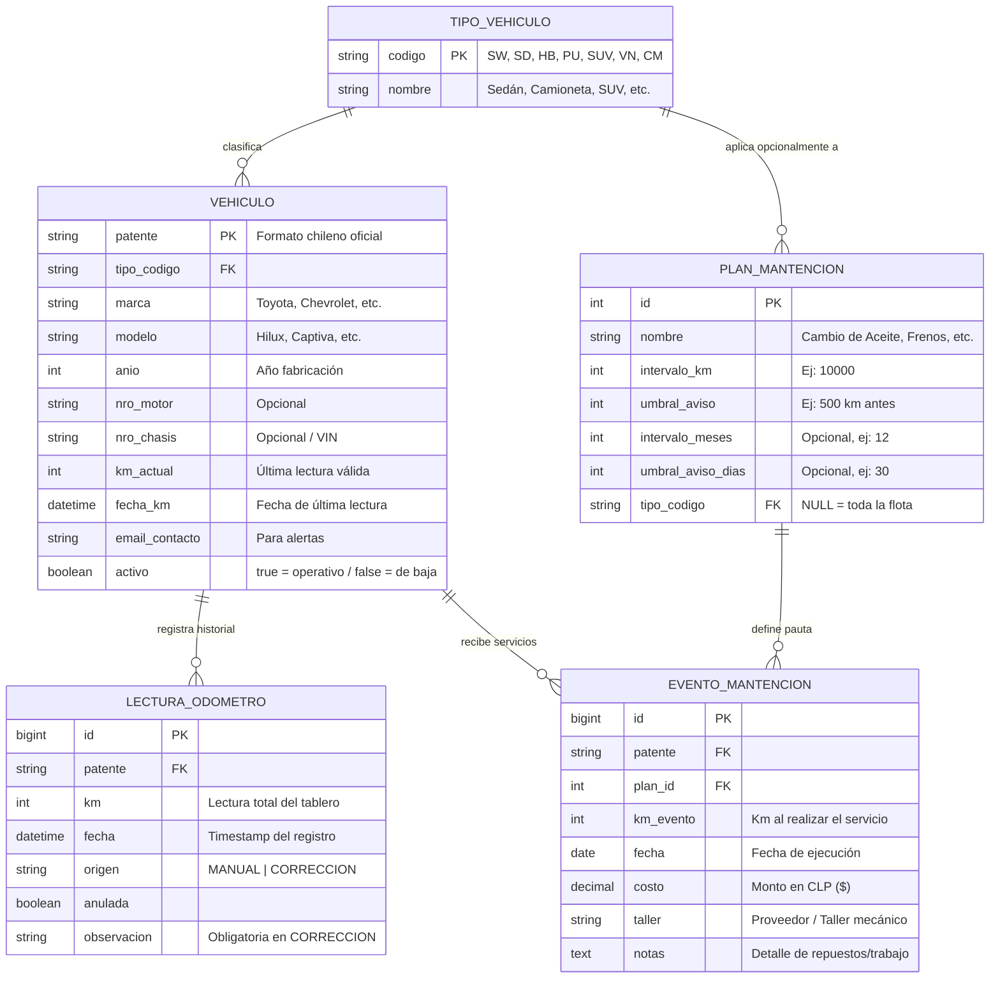

# 🚗 AutoTrack KM — Sistema de Control de Kilometraje y Mantención Vehicular
> **Documento de Especificación de Producto y Diseño Frontend para Stitch / AI UI Builder**

---

## 📌 1. Visión General del Proyecto

**AutoTrack KM** es una plataforma telemática y de gestión de flotas vehiculares orientada al control preciso del kilometraje y a la programación preventiva/correctiva de mantenciones automotrices. 

El sistema resuelve el problema del desgaste no supervisado de flotas, evitando sobrecostos por servicios atrasados y fallas mecánicas mayores mediante un sistema inteligente de cálculo de desgaste por kilometraje y tiempo.

### Objetivos Clave del Frontend
1. **Panel de Control Visual de Alto Impacto**: Presentar el estado de salud de toda la flota en tiempo real con semáforos de urgencia y gráficos dinámicos.
2. **Registro de Odómetro Ágil y Confiable**: Permitir la carga de lecturas en menos de 5 segundos desde computadoras o celulares.
3. **Matriz Visual de Desgaste por Vehículo**: Mostrar el avance porcentual hacia el próximo cambio de aceite, frenos, filtros o distribución con barras de progreso e indicadores visuales.
4. **Experiencia y Estética Automotriz Premium**: Inspirada en tableros digitales modernos (HUD), placas patentes chilenas realistas, colores de alta visibilidad, gráficos de telemetría y micro-animaciones.

---

## 📐 2. Reglas de Negocio Inmutables (Core Logic)

Al diseñar o construir las interfaces y formularios, se deben respetar estrictamente las siguientes reglas:

1. **Lectura de Odómetro Absoluta (Nunca incrementos)**:
   - El usuario informa el valor total que marca el tablero del vehículo (ej: `45.320 km`), **nunca** el incremento (ej: `+50 km`).
2. **El Odómetro No Retrocede**:
   - Una lectura menor al kilometraje actual del vehículo se rechaza automáticamente. Solo se permite si se marca explícitamente como **"Corrección"** (`origen = 'CORRECCION'`), requiriendo un campo de observación obligatorio que explique el motivo.
3. **Salto Sospechoso (> 5.000 km)**:
   - Si la nueva lectura supera en más de 5.000 km a la anterior, la interfaz debe solicitar una confirmación explícita (checkbox de seguridad) para evitar errores de tipeo (ej: ingresar `453200` en vez de `45320`).
4. **Detección de Mantención (`km_faltantes <= umbral_aviso`)**:
   - Un servicio entra en ventana de aviso cuando `(km_ultimo_servicio + plan.intervalo_km) - km_actual <= plan.umbral_aviso`.
   - La condición evalúa números negativos (si `km_faltantes < 0`, el servicio está **VENCIDO** y se muestra el atraso exacto: *"Vencido hace X km"*).
5. **Criterio "Lo que ocurra primero" (Km o Tiempo)**:
   - Los planes pueden configurarse por kilometraje (ej. cada 10.000 km), por tiempo (ej. cada 12 meses) o ambos. La alerta se activa por el eje que primero alcance el límite.
6. **Formato de Placa Patente Chilena**:
   - Formato nuevo (desde 2007): 4 letras + 2 números (ej: `PBSY·69` o `HGTR·82`).
   - Formato antiguo: 2 letras + 4 números (ej: `AB·1234`) o 3 letras + 3 números.
   - Debe visualizarse con el diseño oficial de patente chilena.

---

## 🗄️ 3. Modelo de Datos y Entidades



---

## 🖥️ 4. Estructura de Pantallas y Módulos del Frontend

### 1. Dashboard Principal (`/dashboard`)
- **Cabecera Ejecutiva**:
  - Saludo y resumen de estado global.
  - Botón de acción rápida: **"+ Registrar Odómetro"** (abre modal) y **"+ Nuevo Vehículo"**.
- **Panel de Métricas (5 Stat Cards con Gradientes e Iconos)**:
  1. *Flota Activa*: Total de vehículos en operación (con desglose de unidades de baja).
  2. *Servicios Vencidos*: Contador con alerta roja pulsante y llamado urgente a atención.
  3. *Próximos a Vencer*: Contador amarillo preventivo de servicios en ventana de aviso.
  4. *Km Totales Flota*: Kilometraje total acumulado por todos los vehículos.
  5. *Inversión en Servicios*: Gasto total acumulado ($ CLP) en mantenciones realizadas.
- **Sección de Analítica Visual**:
  - *Gráfico de Dona (Salud de la Flota)*: Proporción de vehículos Al Día (verde), Por Vencer (ámbar) y Vencidos (rojo).
  - *Gráfico de Barras (Distribución de Flota)*: Cantidad de vehículos por categoría (Camionetas, SUVs, Sedanes, Furgones).
- **Tabla de Alertas de Mantención Priorizadas**:
  - Ordenada automáticamente: primero servicios vencidos (por mayor atraso), luego los más cercanos a vencer.
  - Columnas: Placa Patente Chilena (`<x-plate>`), Vehículo, Servicio Requerido, Estado (Badge rojo/amarillo con pulso), Detalle en Km y Días, Botones de acción ("+ Odómetro", "Atender Ficha →").

---

### 2. Módulo de Vehículos (`/vehiculos` y `/vehiculos/{patente}`)

#### 2.1 Listado de Vehículos (`/vehiculos`)
- **Filtros Dinámicos**: Búsqueda por patente, selector por tipo de vehículo y checkbox para incluir vehículos dados de baja.
- **Tabla y Tarjetas Responsivas**:
  - Placa Patente Chilena oficial.
  - Marca, modelo, año y correo.
  - Badge tipo de vehículo.
  - Kilometraje actual destacado con badge monospace.
  - Estado: Activo (Verde) / De baja (Gris).
  - Acciones: "+ Odómetro", "Ver Ficha", "Editar", "Dar de Baja / Reactivar".

#### 2.2 Ficha Detallada del Vehículo (`/vehiculos/{patente}`)
- **Hero Header**:
  - Placa Patente en tamaño grande con marco de relieve 3D.
  - Especificaciones (Marca, Modelo, Año, Tipo, Motor, Chasis, Email).
  - Botón "Editar Ficha" y "Volver".
- **Cluster Digital de Odómetro (HUD)**:
  - Tarjeta oscura con estética de tablero automotriz (fondo degradado slate oscuro, dígitos LCD grandes color cian brillante con resplandor suave).
  - Fecha y hora del último reporte.
  - Mini formulario directo para cargar nueva lectura absoluta.
  - Desplegable suave (acordeón) para ingresar motivo si se marca como corrección.
  - Alerta de salto > 5.000 km con confirmación requerida.
- **Matriz de Salud de Mantenciones (Tarjetas por Plan)**:
  - Una tarjeta por cada plan aplicable (Aceite, Filtros, Frenos, Distribución, etc.).
  - **Barra de Desgaste Visual Porcentual**: Calcula el porcentaje consumido del intervalo (`0%` recién hecho -> `100%` cumplido).
    - Verde: `< 80%`
    - Amarillo: `80% - 99%` (Por vencer)
    - Rojo: `>= 100%` (Vencido)
  - Métricas claras: Km restantes / de atraso, Días restantes, Próximo objetivo en Km y Fecha.
- **Sección de Registro de Servicios Realizados**:
  - Formulario: Plan aplicado, Km al realizarlo, Fecha, Costo en CLP, Taller y Notas.
  - Botón con degradado esmeralda "Guardar Registro de Servicio".
- **Línea de Tiempo de Servicios Anteriores**:
  - Historial de mantenciones ejecutadas con fecha, taller, costo en badge y repuestos reemplazados.
- **Tabla de Auditoría de Odómetro**:
  - Historial completo de lecturas cronológicas (Fecha/hora, Km, Origen MANUAL/CORRECCION, Observación).

---

### 3. Módulo de Planes de Mantención (`/planes-mantencion`)
- **Listado en Tarjetas y Tabla**:
  - Nombre del plan con icono de herramienta/servicio.
  - Intervalo en Km (ej. cada 10.000 km) y/o Meses (ej. cada 12 meses).
  - Umbral de aviso preventivo en Km y Días.
  - Badge de aplicabilidad: "Toda la flota (Global)" o "Solo para Camionetas (PU)".
  - Botones de Edición y Eliminación.
- **Formulario Crear/Editar Plan**:
  - Inputs con validación numérica y selector de tipo de vehículo.

---

### 4. Módulo de Reportes de Kilometraje (`/reportes/km`)
- **Filtros por Período**: Rango de mes inicio (`YYYY-MM`) a mes fin (`YYYY-MM`) y filtro por patente.
- **Gráfico de Líneas de Evolución Mensual**:
  - Curva interactiva de kilómetros totales recorridos por la flota mes a mes.
- **Tabla Matriz Mensual**:
  - Filas: Vehículos con patente chilena.
  - Columnas: Cada mes del rango con los kilómetros recorridos en ese período (calculado por diferencia de cierres de odómetro).
  - Totales: Total por vehículo y fila de totales de flota por mes.
- **Botón "Exportar CSV"**.

---

### 5. Modal Global de Lectura Rápida (`<x-quick-odometro-modal>`)
- Modal flotante con desenfoque de fondo (*backdrop blur*).
- Selector rápido con autocompletado de vehículos activos.
- Al seleccionar un vehículo, muestra su kilometraje actual en pantalla.
- Input numérico para ingresar la nueva lectura del tablero.
- Checkbox de corrección con campo de motivo.
- Guardado instantáneo con feedback visual y refresco de datos.

---

## 🎨 5. Guía de Estilo y Sistema de Diseño

### Paleta de Colores
| Rol | Color Hex | Tailwind Class | Uso |
| :--- | :--- | :--- | :--- |
| **Canvas / Fondo** | `#f8fafc` | `bg-slate-50` | Fondo general de la aplicación con degradado sutil |
| **Superficie** | `#ffffff` | `bg-white` | Tarjetas, tablas, modales |
| **Bordes** | `#e2e8f0` | `border-slate-200` | Separadores y contornos de tarjetas |
| **Texto Principal** | `#0f172a` | `text-slate-900` | Títulos, valores y etiquetas de énfasis |
| **Texto Secundario** | `#64748b` | `text-slate-500` | Subtítulos, leyendas, metadatos |
| **Acento Primario** | `#4f46e5` / `#4338ca` | `bg-indigo-600` | Botones de acción, enlaces activos, branding |
| **Salud Óptima (Success)** | `#10b981` | `text-emerald-600` | Vehículos al día, servicios registrados |
| **Advertencia (Warning)** | `#f59e0b` | `text-amber-500` | Servicios por vencer en ventana de aviso |
| **Crítico / Alerta (Danger)**| `#ef4444` | `text-rose-500` | Servicios vencidos, atrasos de km |
| **Cluster HUD** | `#090d16` a `#111827`| `bg-slate-950` | Fondo de velocímetro y odómetro digital |
| **Dígitos LCD** | `#38bdf8` / `#22d3ee` | `text-cyan-400` | Números de kilometraje en tablero digital |

### Componentes Visuales Exclusivos
1. **Placa Patente Chilena (`.chile-plate`)**:
   - Marco blanco con relieve, borde negro redondeado (`border-2 border-slate-900`).
   - Bloque azul a la izquierda con estrella blanca (`★`).
   - Tipografía monospace condensada ultra-negrita (`font-black tracking-widest text-slate-900`).
2. **Badges Pulsantes**:
   - Punto de color con efecto `animate-ping` para mantenciones vencidas.
3. **Elevación de Tarjetas**:
   - Sombra difusa `shadow-xs` que pasa a `shadow-md` con traslación `-translate-y-1` al pasar el cursor.

---

## 🔌 6. Mapa de Rutas y Endpoints de la API / Backend

| Método | Ruta | Descripción | Payload / Parámetros |
| :--- | :--- | :--- | :--- |
| `GET` | `/dashboard` | Dashboard principal con KPIs y alertas | — |
| `GET` | `/vehiculos` | Listado de vehículos con filtros | `?patente=&tipo_codigo=&mostrar_inactivos=` |
| `POST` | `/vehiculos` | Crear nuevo vehículo | `{ patente, tipo_codigo, marca, modelo, anio, email_contacto, ... }` |
| `GET` | `/vehiculos/{patente}` | Ficha de vehículo, cluster y estados | — |
| `PUT` | `/vehiculos/{patente}` | Actualizar datos del vehículo | `{ tipo_codigo, marca, modelo, anio, email_contacto, ... }` |
| `DELETE`| `/vehiculos/{patente}` | Dar de baja vehículo | — |
| `PATCH` | `/vehiculos/{patente}/activar` | Reactivar vehículo | — |
| `POST` | `/vehiculos/{patente}/lecturas` | Registrar lectura de odómetro | `{ km, es_correccion, observacion, confirmar_salto }` |
| `POST` | `/vehiculos/{patente}/eventos-mantencion` | Registrar servicio realizado | `{ plan_id, km_evento, fecha, costo, taller, notas }` |
| `GET` | `/planes-mantencion` | CRUD de planes de servicio | — |
| `POST` | `/planes-mantencion` | Crear plan de mantención | `{ nombre, intervalo_km, umbral_aviso, intervalo_meses, ... }` |
| `GET` | `/reportes/km` | Reporte mensual de kilómetros | `?desde=YYYY-MM&hasta=YYYY-MM&patente=` |
| `GET` | `/reportes/km/exportar` | Descarga de reporte en archivo CSV | `?desde=YYYY-MM&hasta=YYYY-MM&patente=` |

---

## 💡 7. Prompt Recomendado para Stitch / AI UI Builder

Si vas a copiar y pegar este documento en Stitch o en un generador de UI, puedes usar este encabezado:

```text
Actúa como un Diseñador UI/UX y Desarrollador Frontend experto en dashboards telemáticos y automotrices. 
Utiliza las especificaciones técnicas, reglas de negocio, componentes visuales y paleta de colores detalladas en este documento Markdown para diseñar y generar la interfaz de usuario completa de "AutoTrack KM".

Requisitos indispensables:
1. Implementa el componente de Placa Patente Chilena oficial.
2. Diseña el Dashboard ejecutivo con KPIs y gráficos interactivos (Salud de flota y distribución de tipos).
3. En la ficha de vehículo, diseña el Odómetro Digital HUD y las tarjetas con barras de progreso de desgaste para cada plan de mantención.
4. Diseña el Modal Global de Lectura Rápida de odómetro.
5. Utiliza una estética limpia, moderna, con esquinas redondeadas, contrastes nítidos y micro-interacciones.
```
