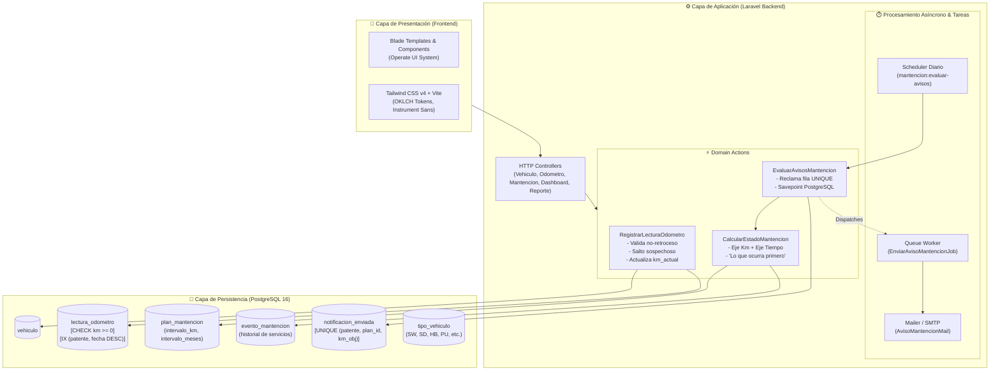
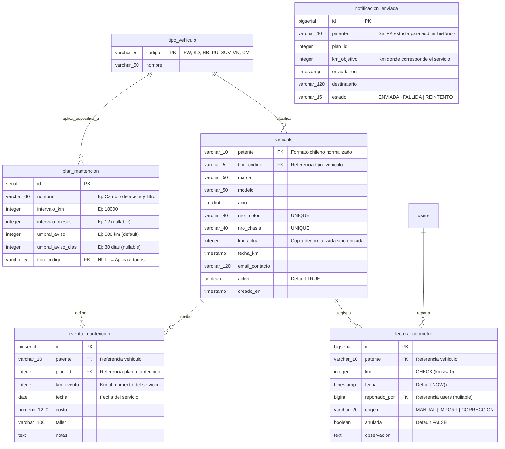
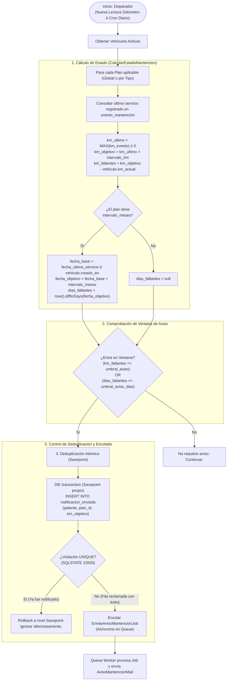
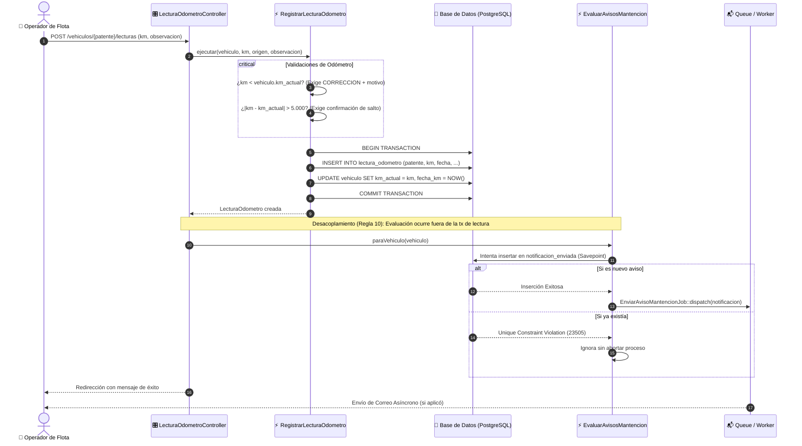

# 🚗 Sistema de Control de Kilometraje y Gestión de Mantenciones Vehiculares

<p align="center">
  
  
  
  
  
  
</p>

---

## 📌 Descripción General

El **Sistema de Control de Kilometraje y Gestión de Mantenciones** es una plataforma web integral diseñada para la administración, auditoría de odómetro y calendarización predictiva de servicios preventivos en flotas vehiculares. 

Desarrollado bajo una arquitectura robusta orientada a dominios y acciones (`Single-Action Controllers` y `Action Classes`), el sistema garantiza la trazabilidad total del kilometraje, previene desfasajes de odómetro mediante lecturas absolutas y gestiona alertas preventivas multieje (**Kilometraje** y **Tiempo transcurrido**, *"lo que ocurra primero"*), con deduplicación atómica de notificaciones a nivel de base de datos.

---

## 🌟 Características Principales

- **Gestión Integral de Flota:** Catálogo estandarizado de tipos de vehículos (`SW`, `SD`, `HB`, `PU`, `SUV`, `VN`, `CM`), alta, edición, filtros por patente/tipo y baja lógica de vehículos.
- **Validación Estricta de Patentes Chilenas:** Normalización y validación regex de formatos chilenos (`LLLL·NN` posteriores a 2007, `LL·NNNN` y `LLL·NNN` antiguos).
- **Auditoría y Trazabilidad de Odómetro:**
  - Registro de lecturas absolutas del tablero (fuente de verdad inmutable).
  - Bloqueo de retroceso de odómetro (salvo correcciones auditadas con justificación obligatoria).
  - Detección de saltos sospechosos (> 5.000 km) que requieren confirmación explícita.
- **Motor Predictivo de Mantenciones (Dual Axis: Km / Tiempo):**
  - Configuración dinámica de planes de servicio (globales o específicos por tipo de vehículo).
  - Evaluación continua: cálculo de próximo servicio según `MAX(km_evento) + intervalo_km` y `fecha_ultimo_servicio + intervalo_meses`.
  - Umbrales de advertencia configurables en km y días.
- **Sistema de Notificaciones con Deduplicación Atómica:**
  - Doble disparador: evaluación reactiva inmediata al ingresar una lectura y evaluación global diaria mediante cron/scheduler.
  - Deduplicación física en PostgreSQL con índice único `UNIQUE(patente, plan_id, km_objetivo)` y aislamiento en savepoints.
  - Encolado asíncrono de correos con diseño responsive y diferenciación entre servicios *próximos* y *vencidos*.
- **Dashboard Operativo en Tiempo Real:** Visualización rápida de vehículos críticos, ordenados por estado de vencimiento y cercanía al servicio.
- **Métricas y Reportes de Kilometraje:** Matriz mensual de consumo de km por vehículo y exportación a **CSV** optimizada con UTF-8 BOM para Microsoft Excel.
- **Interfaz UI/UX "Operate" de Alto Rendimiento:** Diseñada con Tailwind CSS v4, paleta de colores OKLCH de alto contraste y legibilidad, tipografía *Instrument Sans* y microanimaciones optimizadas.

---

## 🏗️ Arquitectura del Sistema

El siguiente diagrama detalla la arquitectura desacoplada del sistema, sus capas de abstracción y flujo de datos:



---

## 🗄️ Modelo Entidad-Relación (ERD)

Diagrama de base de datos relacional con claves primarias, foráneas, tipos de datos e índices críticos:



> **Nota técnica:** `notificacion_enviada` cuenta con una restricción de unicidad compuesta `UNIQUE (patente, plan_id, km_objetivo)` que actúa como barrera de concurrencia para evitar correos duplicados.

---

## 🔄 Flujo del Algoritmo de Evaluación de Mantenciones

El motor evalúa si un vehículo ha entrado en la ventana de aviso para un plan determinado y garantiza que se notifique solo una vez:



---

## ⚡ Secuencia: Registro de Lectura y Evaluación Inmediata



---

## 🛠️ Stack Tecnológico

| Capa / Componente | Tecnología | Versión | Propósito / Características |
|---|---|---|---|
| **Lenguaje** | **PHP** | `8.4+` | Tipado estricto, constructor property promotion, readonly classes. |
| **Framework Backend** | **Laravel** | `12.x` | Routing, Eloquent ORM, Form Requests, Queues, Mailers, Scheduler. |
| **Base de Datos** | **PostgreSQL** | `16+` | CHECK constraints nativos, índices compuestos descendentes, atomic savepoints. |
| **Frontend / CSS** | **Tailwind CSS** | `v4.0` | Arquitectura moderna con `@theme`, tokens semánticos en espacio de color OKLCH. |
| **Build Tool** | **Vite** | `8.0` | Compilación ultra rápida de assets frontend. |
| **Tipografía** | **Instrument Sans** | Google Fonts | Tipografía moderna, de alta legibilidad en interfaces de datos. |
| **Testing** | **PHPUnit** | `12.x` | Suite exhaustiva de pruebas unitarias y de integración sobre PostgreSQL. |
| **Colas / Worker** | **Database Queue** | Laravel Queue | Encolado y reintento resiliente de correos transaccionales. |

---

## 📜 Reglas de Negocio Inmutables

El diseño del sistema se rige por **10 reglas críticas** que aseguran la consistencia de datos y la fiabilidad operacional:

1. **Lectura Absoluta:** El odómetro se guarda como el valor total del tablero (ej. `45320`), nunca como incrementos (`+50 km`). Esto asegura la autocorrección ante lecturas omitidas.
2. **Intervalos Dinámicos:** Los intervalos no están hardcodeados en código; residen en `plan_mantencion`.
3. **Umbrales Dinámicos:** El aviso preventivo es configurable por plan (`umbral_aviso` en km y `umbral_aviso_dias` en días).
4. **Comparación Abierta (`<=`):** La ventana de aviso evalúa `km_faltantes <= umbral_aviso`, permitiendo valores negativos. Si un vehículo salta de 9.800 km a 10.400 km, el sistema detecta que está vencido y dispara la alerta igualmente.
5. **Catálogo de Tipos en Base de Datos:** Los tipos vehiculares residen en `tipo_vehiculo`, facilitando su expansión sin migraciones de enums.
6. **Deduplicación por Clave Única:** La prevención de correos repetidos descansa en `UNIQUE (patente, plan_id, km_objetivo)` de `notificacion_enviada`.
7. **Patente Chilena Estricta:** Validación de formatos oficiales `LLLL·NN`, `LL·NNNN` y `LLL·NNN`, normalizando a mayúsculas sin guiones ni puntos.
8. **Odómetro No Retrocede:** Bloqueo de lecturas menores al `km_actual`, habilitado únicamente con origen `CORRECCION` y justificación en texto obligatoria.
9. **Entorno Seguro de Correo:** Driver `log` por defecto en desarrollo para evitar spam accidental a correos reales.
10. **Desacoplamiento Transaccional:** El envío o encolado de correos **nunca** se ejecuta dentro de la transacción SQL que persiste la lectura de odómetro.

---

## 📂 Estructura del Proyecto

```plaintext
Sistema_Autos_KM/
├── app/
│   ├── Actions/                        # Lógica de dominio pura y desacoplada
│   │   ├── CalcularEstadoMantencion.php # Cálculo de faltantes en km y tiempo
│   │   ├── EvaluarAvisosMantencion.php  # Deduplicación y encolado de alertas
│   │   └── RegistrarLecturaOdometro.php # Validaciones e inserción de odómetro
│   ├── Console/Commands/
│   │   └── EvaluarAvisosMantencionCommand.php # Comando artisan mantencion:evaluar-avisos
│   ├── Enums/
│   │   └── OrigenLectura.php           # MANUAL, IMPORT, CORRECCION
│   ├── Exceptions/Odometro/            # Excepciones de negocio de odómetro
│   │   ├── OdometroRetrocedeException.php
│   │   └── SaltoSospechosoException.php
│   ├── Http/Controllers/              # Controladores RESTful limpios
│   │   ├── DashboardController.php
│   │   ├── EventoMantencionController.php
│   │   ├── LecturaOdometroController.php
│   │   ├── PlanMantencionController.php
│   │   ├── ReporteKmController.php
│   │   └── VehiculoController.php
│   ├── Http/Requests/                 # FormRequests con validaciones
│   ├── Jobs/
│   │   └── EnviarAvisoMantencionJob.php # Job encolado de envío de email
│   ├── Mail/
│   │   └── AvisoMantencionMail.php      # Mailable con asuntos diferenciados
│   ├── Models/                        # Modelos Eloquent
│   │   ├── EventoMantencion.php
│   │   ├── LecturaOdometro.php
│   │   ├── NotificacionEnviada.php
│   │   ├── PlanMantencion.php
│   │   ├── TipoVehiculo.php
│   │   └── Vehiculo.php
│   ├── Rules/
│   │   └── PatenteChilena.php          # Validador de formato de patente
│   └── ValueObjects/
│       └── EstadoMantencionPlan.php    # Inmutable: km/tiempo faltantes y estados
├── database/
│   ├── migrations/                     # DDL con CHECKs e índices PostgreSQL
│   └── seeders/                        # Seeders de catálogo (TipoVehiculoSeeder)
├── resources/
│   ├── css/app.css                     # Tokens de diseño @theme OKLCH
│   └── views/                          # Plantillas Blade (Operate UI)
│       ├── components/                 # Componentes Blade (<x-button>, <x-badge>, etc.)
│       ├── dashboard/                  # Dashboard de flota y vencimientos
│       ├── emails/                     # Plantilla HTML del aviso de mantención
│       ├── layouts/                    # Layout principal con navegación
│       ├── planes-mantencion/          # CRUD de planes de servicio
│       ├── reportes/                   # Matriz de km mensual y exportación CSV
│       └── vehiculos/                  # Ficha vehicular, historial y reportes de km
├── routes/
│   ├── console.php                     # Scheduler diario configurado
│   └── web.php                         # Rutas web del sistema
├── tests/
│   └── Unit/                           # Suite de pruebas unitarias
│       ├── Actions/                    # Tests de cálculo, alertas y odómetro
│       └── Jobs/                       # Tests de procesamiento de jobs
├── dev-server-router.php               # Router para servidor local de desarrollo
├── phpunit.xml                         # Configuración de pruebas para PostgreSQL
└── vite.config.js                      # Configuración de Vite y Tailwind v4
```

---

## 🚀 Guía de Instalación y Puesta en Marcha

### Prerrequisitos

- **PHP 8.3 o 8.4** con extensiones: `pdo_pgsql`, `pgsql`, `mbstring`, `openssl`, `curl`.
- **Composer 2.x**
- **Node.js 20+** y **npm**
- **PostgreSQL 15+** en ejecución local o remota.

---

### 1. Clonar el repositorio

```bash
git clone https://github.com/NicolasPonceH/Sistema_Autos_KM.git
cd Sistema_Autos_KM
```

### 2. Instalar dependencias

```bash
# Dependencias PHP de Laravel
composer install

# Dependencias Frontend (Tailwind CSS v4, Vite)
npm install
```

### 3. Configurar variables de entorno

Copia el archivo `.env.example` a `.env`:

```bash
cp .env.example .env
```

Genera la clave de aplicación:

```bash
php artisan key:generate
```

Configura tu conexión a PostgreSQL en `.env`:

```env
DB_CONNECTION=pgsql
DB_HOST=127.0.0.1
DB_PORT=5432
DB_DATABASE=sistema_autos_km
DB_USERNAME=tu_usuario_postgres
DB_PASSWORD=tu_password_postgres

QUEUE_CONNECTION=database
MAIL_MAILER=log
```

### 4. Ejecutar Migraciones y Seeders

```bash
php artisan migrate --seed
```

Esto creará todas las tablas, restricciones `CHECK`, índices compuestos y poblará el catálogo de `tipo_vehiculo`.

---

### 5. Levantar el Entorno de Desarrollo

Para ejecutar el proyecto en local se requieren dos procesos en terminales independientes:

#### Terminal 1 — Servidor Web PHP:
> **Nota para Windows:** Se incluye `dev-server-router.php` para asegurar compatibilidad total en rutas con caracteres especiales o tildes.

```bash
php -S 127.0.0.1:8000 -t public dev-server-router.php
```

#### Terminal 2 — Compilador de Assets Vite:

```bash
npm run dev
```

#### Terminal 3 (Opcional) — Procesador de Colas de Notificaciones:

Para procesar los correos encolados:

```bash
php artisan queue:work
```

Accede al sistema desde tu navegador en: [http://127.0.0.1:8000](http://127.0.0.1:8000).

---

## 🧪 Ejecución de Pruebas Automatizadas

El proyecto cuenta con una batería de pruebas unitarias que cubren los casos críticos de cálculo, retroceso de odómetro, deduplicación en base de datos y envío de correos.

Para ejecutar los tests sobre PostgreSQL:

```bash
php vendor/bin/phpunit -c phpunit.xml
```

### Casos de Prueba Verificados:
- [x] **Salto por sobre la ventana:** Detección de servicio vencido cuando una lectura brinca sobre el kilometraje objetivo.
- [x] **Kilómetros faltantes negativos:** Generación correcta del estado vencido y texto personalizado en el correo.
- [x] **Deduplicación atómica:** Múltiples lecturas consecutivas en la misma ventana solo generan un único aviso.
- [x] **Reinicio de ciclo post-servicio:** Registro de `evento_mantencion` recalcula el objetivo al siguiente intervalo.
- [x] **Protección contra retroceso:** Rechazo de lecturas inferiores a `km_actual` salvo correcciones válidas.
- [x] **Segmentación por tipo:** Exclusión de planes asignados a un tipo vehicular específico sobre otros vehículos.
- [x] **Dual Axis Time/Km:** Evaluación correcta de mantenciones por meses transcurridos vs km recorridos.

---

## ⏰ Tareas Programadas (Scheduler)

El sistema incluye una tarea programada para la evaluación preventiva diaria de toda la flota activa:

```bash
# Ejecutar manualmente la evaluación de avisos
php artisan mantencion:evaluar-avisos
```

En entornos de producción, configurar el cron de Linux:

```cron
* * * * * cd /ruta-al-proyecto && php artisan schedule:run >> /dev/null 2>&1
```

---

## 📄 Licencia

Este proyecto es software de código abierto bajo la licencia [MIT](LICENSE).

---

<p align="center">
  Desarrollado con ❤️ para la gestión moderna y eficiente de flotas vehiculares.
</p>
